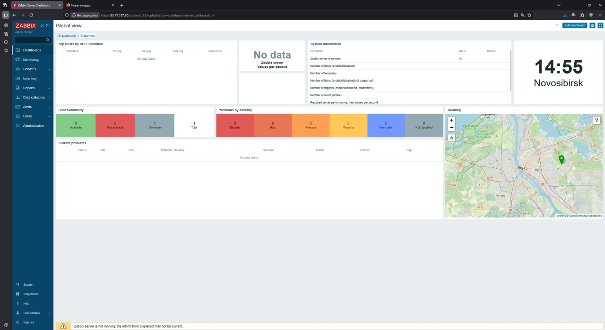
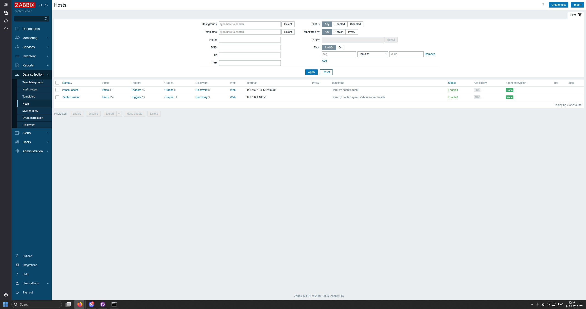
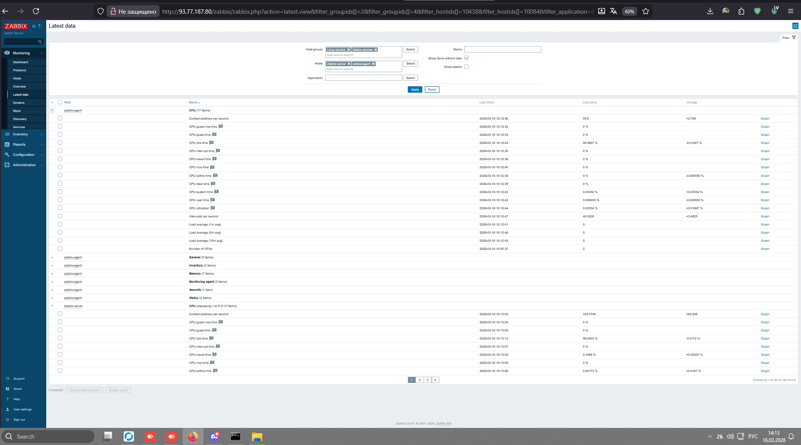
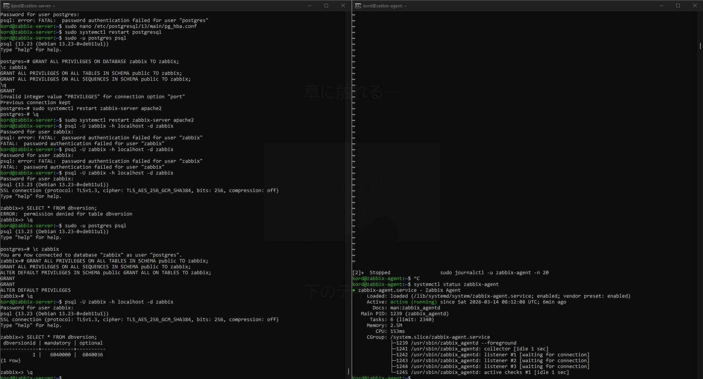

# Домашнее задание к занятию "Система мониторинга Zabbix" — Шумихин Кирилл

---

## Задание 1

### Установка Zabbix Server с веб-интерфейсом

В рамках задания был установлен сервер мониторинга Zabbix на виртуальной машине Debian 11.

### Установка PostgreSQL

```bash
sudo apt update
sudo apt upgrade -y
sudo apt install postgresql -y
```

### Добавление репозитория Zabbix

```bash
wget https://repo.zabbix.com/zabbix/6.4/debian/pool/main/z/zabbix-release/zabbix-release_6.4-1+debian11_all.deb
sudo dpkg -i zabbix-release_6.4-1+debian11_all.deb
sudo apt update
```

### Установка Zabbix Server

```bash
sudo apt install zabbix-server-pgsql zabbix-frontend-php zabbix-apache-conf zabbix-sql-scripts zabbix-agent -y
```

### Создание базы данных

```bash
sudo -u postgres psql
```

```sql
CREATE USER zabbix WITH PASSWORD 'zabbix';
CREATE DATABASE zabbix OWNER zabbix;
ALTER ROLE zabbix SET client_encoding TO 'utf8';
ALTER ROLE zabbix SET default_transaction_isolation TO 'read committed';
ALTER ROLE zabbix SET timezone TO 'UTC';
```

### Импорт структуры базы данных

```bash
sudo -u postgres zcat /usr/share/zabbix-sql-scripts/postgresql/server.sql.gz | sudo -u postgres psql zabbix
```

### Настройка Zabbix Server

```bash
sudo nano /etc/zabbix/zabbix_server.conf
```

Изменён параметр:

```
DBPassword=zabbix
```

### Запуск сервисов

```bash
sudo systemctl restart zabbix-server zabbix-agent apache2
sudo systemctl enable zabbix-server zabbix-agent apache2
```

### Веб-интерфейс

После установки веб-интерфейс доступен по адресу:

```
http://IP_сервера/zabbix
```

Стандартные учетные данные:

```
Login: Admin
Password: zabbix
```

### Скриншот панели администратора



---

## Задание 2

### Установка Zabbix Agent на два хоста

Была создана вторая виртуальная машина и установлен агент Zabbix.

### Установка агента

```bash
sudo apt update
sudo apt install zabbix-agent -y
```

### Настройка агента

```bash
sudo nano /etc/zabbix/zabbix_agentd.conf
```

Изменены параметры:

```
Server=93.77.187.80
ServerActive=93.77.187.80
Hostname=zabbix-agent
```

### Запуск агента

```bash
sudo systemctl restart zabbix-agent
sudo systemctl enable zabbix-agent
```

Проверка статуса:

```bash
systemctl status zabbix-agent
```

### Проверка логов агента

```bash
sudo journalctl -u zabbix-agent -n 20
```

---

### Добавление хоста в Zabbix

В веб-интерфейсе Zabbix:

```
Data collection → Hosts → Create host
```

Параметры хоста:

```
Host name: zabbix-agent
Template: Linux by Zabbix agent
Group: Linux servers
Interface type: Agent
IP: 158.160.104.120
Port: 10050
```

После добавления хоста агент успешно подключился к серверу.

---

### Скриншоты

#### Подключенный агент



#### Получение метрик



#### Лог агента



---

## Результат

1. Установлен сервер мониторинга Zabbix с веб-интерфейсом.
2. Настроена база данных PostgreSQL.
3. Установлен и подключен Zabbix Agent на второй виртуальной машине.
4. Проверено получение метрик в системе мониторинга.

Система мониторинга работает корректно.
